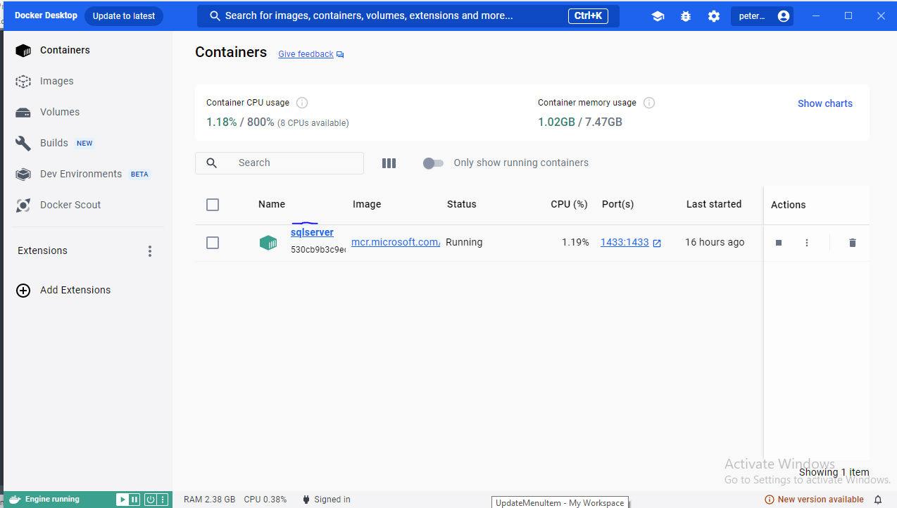
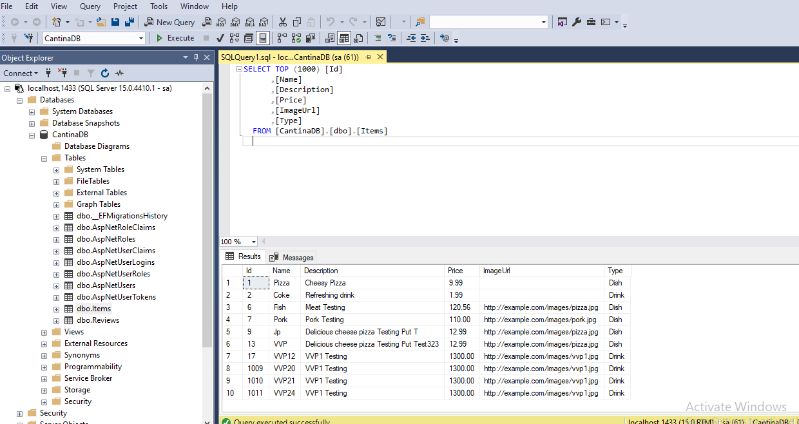
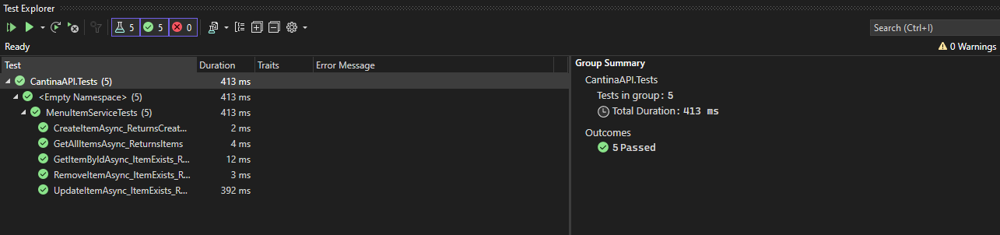

# CantinaAPI(Versioned)

## Overview

Cantina API is a robust, production-ready REST API built using ASP.NET Core 8. It provides functionality for managing menu items (dishes and drinks), user authentication and authorization, and rating and reviewing menu items. This API adheres to best practices, is designed with maintainability and scalability in mind, and follows SOLID principles.
The only think that is questionable on the production readiness is the use of in-memory cache. This is not recommended for production use, as it is not distributed and does not scale well. For production use, a distributed cache like Redis should be used. The storing of secrets, i would have loved to use something like Vault to store all my secrets or even have them in the environment variables

---

## Features

- **Menu Item Management**:
  - Create, view, list, update, and delete dishes and drinks.
  - Menu items have a name, description, price, and image.
  - Supports searching for menu items.

- **Rating and Review**:
  - Customers can rate and review menu items.

- **Authentication & Authorization**:
  - User registration and login with password-based authentication.
  - Supports OAuth2-based Single Sign-On (SSO) with Google.
  - Password policies and brute-force attack prevention.
  - Role-based permission handling.

- **Cache Optimization**:
  - Menu items are cached for optimal performance.
  - Cache settings are configurable.

- **Secure and Validated**:
  - Entity validation for all data models.
  - Prevention against brute-force attacks using rate-limiting.

---

## Prerequisites

- [.NET 8 SDK](https://dotnet.microsoft.com/download)
- [Docker](https://www.docker.com/)
- Docker Desktop
- Docker containerized MSSQL Server

---

## Setup Instructions


### 1. Create SQL server container using Docker 
```bash
docker run -e "ACCEPT_EULA=Y" -e "MSSQL_SA_PASSWORD=******!" -p 1433:1433 -v "sqlvolume:/var/opt/mssql" --name sqlserver mcr.microsoft.com/mssql/server:2019-latest

you can also use the docker-compose file: docker-compose.yaml included in the project directory to create the container
```


### 2. Clone the CantinaAPI Repository
```bash
git clone https://github.com/PeterMakwakwa/CantinaAPI.git
cd cantina-api

restore the project dependencies

```
Please note that the project include the unit tests, so you can run the tests to see if everything is working as expected

### 3. Update appsettings the Connection Strings, and secrets in the appsettings.json file
```json
{
  "ConnectionStrings": {
    "DefaultConnection": "Server=localhost,1433;Database=CantinaDB;User=sa;Password=****;TrustServerCertificate=True;"
  },
  "Logging": {
    "LogLevel": {
      "Default": "Information",
      "Microsoft.AspNetCore": "Warning"
    }
  },
  "Cachetime": "5",
  "AllowedHosts": "*",
  "Jwt": {
    "Key": "*****",
    "Issuer": "https://localhost:7297", // e.g., your application's name
    "Audience": "https://localhost:7297" // e.g., your API consumers
  },
  "Authentication": {
    "Google": {
      "ClientId": "****",
      "ClientSecret": ***"
    },
    "RateLimit": {
      "RequestsPerSecond": 5,
      "Seconds": 1
    }
  }
}

also update jwt secret keys, and google client id and secret in the appsettings.json file
```

### 4. Migrations and Run the API
```bash
dotne add migrations InitialCreate to Seed the database and create all required tables
dotnet ef database update
```
after migrations the following tables will be created and seeded with some sample data


### 5. Run the API and Test
```bash

```


Register the user first and then login to get the token, then you can use the token to access the other endpoints
for the google authentication you can use the following endpoint to get the google token , Please take note of the api version as part of the endpoint
```bash
https://localhost:7297/v1/login-google
https://localhost:7297/v1/google-response
```
Kindly note that for testing i have whitelisted just one email address for the google authentication cantinacat9@gmail.com, you can add more email addresses in the Google cloud console for testing, the reason i did this is because the app is not published , currently running on localhost if it was published i would have added the whitelisted emails to the google cloud console
```bash

i have also included the postman collection in the project directory under Assets, you can import it and test the endpoints
```
[Cantina A P I.Postman Collection](CantinaAPI/Assets/PostmanCollection/CantinaAPI.postman_collection.json)


i decided not to add sensative data in the appsettings.json file, so you will have to add the secrets and connection strings yourself, however i can share with anyone my appsettings .json file with the correct secrets and connection strings if needed


Finally you can run the tests to see if everything is working as expected, i have included the unit tests in the project.


### 6. Run Unit tests using Xunit 





Enjoy.

```bash
